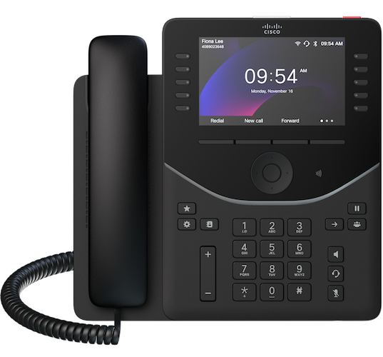

# DeviceFX.NFC
Sample Application to leverage Cisco PhoneOS NFC capabilities

## Demo Video

## Overview

This project is intended to enable leveraging the [Cisco Desk Phone 9800 Series](https://www.webex.com/us/en/devices/phone-series/cisco-phone-9800-series.html) NFC capabilities as simple as possible with a fully functional and documented open source mobile applicaiton for Android and iOS.

The application covers the following scenarios:

* Provision device to Webex User/Workspace
* Write Onboarding mode, including activation code
* Device Inventory including location and asset tagging

## Documentation

The main documentation for this project can be viewed here: [https://nfc.devicefx.com](https://nfc.devicefx.com)

## Feedback

If you have issues using the mobile app or feedback on the applicaiton source code please raise an [Issue](https://github.com/unifiedfx/DeviceFX.NFC/issues/new)

